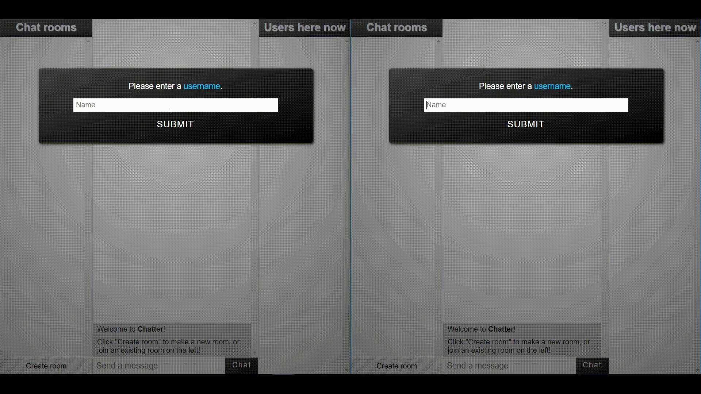

# Multiroom Chat App
A social chatroom application implemented with Node+Express and SocketIO.

  

# Setup and Usage

Set it up yourself or see the [live demo](http://chatter-115.herokuapp.com/).

1. Clone the repository with `git clone <URL>`.
2. Navigate into the newly created directory and `npm install` all dependencies.
3. Start the application using `npm start`.
4. Navigate to `http://localhost:8080` in your browser.
